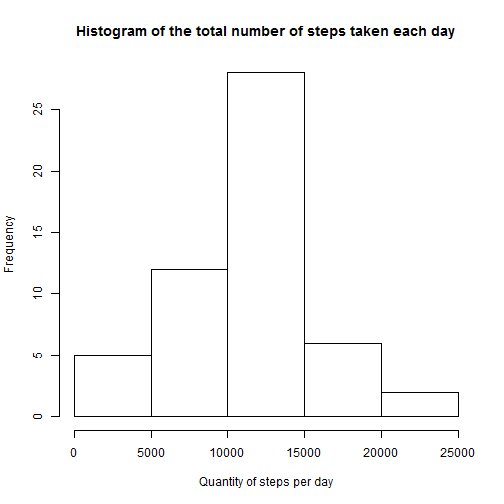
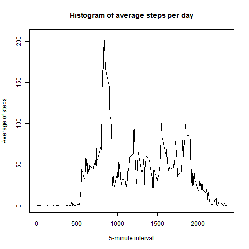
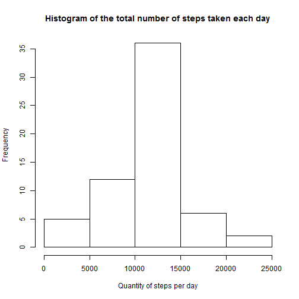

## Loading and preprocessing the data


```r
unzip(zipfile = "activity.zip")
data <- read.csv("activity.csv")
sumData <- aggregate(data$steps, by = list(date = data$date), FUN = sum)
avgData <- aggregate(data$steps, by = list(interval = data$interval), FUN = mean, na.rm = TRUE)
```

## What is mean total number of steps taken per day?

###Histogram of the total number of steps taken each day


```r
hist(sumData$x , xlab = "Quantity of steps per day", main = "Histogram of the total number of steps taken each day")
```

 

###Mean and median total number of steps taken per day

```r
meanData <- mean(sumData$x, na.rm = TRUE)
medianData <- median(sumData$x, na.rm = TRUE)
```

* Mean: **10766.19**
* Median: **10765**

## What is the average daily activity pattern?


```r
plot(avgData$interval, avgData$x, type = "l", xlab = "5-minute interval", ylab = "Average of steps" , main = "Histogram of average steps per day")
```

 

###5-minute interval with maximum averaged number of steps

```r
interval <- avgData[avgData$x == max(avgData$x),"interval"]
```

The 5-minute interval which has the maximum number of steps averaged by day is **835**.

## Imputing missing values

### Quantity of missing values

```r
qty <- sum(is.na(data))
```
The amount of missing values in the data is **2304**.

### New dataset with missing data filled in

```r
newData <- data
newData$avg <- rep(avgData$x,61)
newData$steps[is.na(newData$steps)] <- newData$avg[is.na(newData$steps)]
```

#### Histogram of the total number of steps taken each day


```r
sumNewData <- aggregate(newData$steps, by = list(date = newData$date), FUN = sum)
hist(sumNewData$x , xlab = "Quantity of steps per day", main = "Histogram of the total number of steps taken each day")
```

 

#### Mean and median total number of steps taken per day

```r
meanData <- mean(sumNewData$x, na.rm = TRUE)
medianData <- median(sumNewData$x, na.rm = TRUE)
```

* Mean: **10766.19**
* Median: **10766.19**

The values of mean/median vary a little about the first dataset, because the new dataset is filled in with mean values of each interval. On the other hand, there are more observations available (because there are 2304 more values available than before) and thus, in the histogram there are more observations for the mean value of steps per day.

## Are there differences in activity patterns between weekdays and weekends?

### New dataset which differentiates weekdays and weekends

```r
library(lubridate)
newData$typeDay <- ifelse(wday(newData$date) == 1 | wday(newData$date) == 7,"weekend","weekday")
newData$typeDay <- factor(newData$typeDay)
```


```r
library(lattice)
avgNewData <- aggregate(newData$steps, by = list(interval = newData$interval, typeDay = newData$typeDay), FUN = mean, na.rm = TRUE)
xyplot(x ~ interval| typeDay, data = avgNewData, type = "l", layout = c(1,2), xlab = "Interval", ylab = "Number of steps")
```

 

